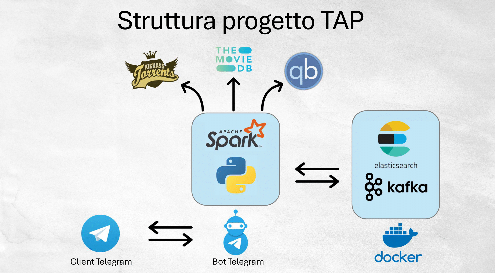

# **Technologies for Advanced Programming**

*Autore: Alberto Bocchieri*  
*Data: 2025-XX-XX*

## **Introduzione**

Questo progetto integra diverse tecnologie per realizzare un sistema completo per la ricerca, il download e il monitoraggio di torrent, con un arricchimento dei dati e un’interfaccia interattiva tramite un Bot Telegram. Il sistema offre funzionalità quali *scraping*, *streaming*, *indicizzazione*, *interazione*, *arricchimento* e *containerizzazione*.

## **Architettura del Sistema**

Il sistema è composto da diversi componenti, ciascuno containerizzato per garantire portabilità e scalabilità:

- **Scraping:** Un'applicazione Python che esegue lo scraping dal sito KickassTorrent per estrarre informazioni sui torrent.
- **Streaming con Kafka:** I dati raccolti vengono inviati a un topic Kafka per lo streaming in tempo reale.
- **Indicizzazione con Elasticsearch:** I torrent vengono indicizzati in Elasticsearch per consentire ricerche e analisi rapide.
- **Bot Telegram:** Un Bot sviluppato in Python permette agli utenti di interagire con il sistema per cercare torrent, avviare download e monitorare il progresso.
- **qBittorrent API:** Il sistema interagisce con qBittorrent tramite la sua API per avviare e monitorare i download.
- **Apache Spark MLlib:** Utilizza l'algoritmo ALS (Alternating Least Squares) per implementare il collaborative filtering e generare raccomandazioni personalizzate.

## **Componenti del Progetto**

### **Scraping e Gestione dei Torrent**

Lo script di scraping utilizza le librerie `requests` e `BeautifulSoup` per:
- Accedere al sito di KickassTorrent.
- Estrarre i titoli e i magnet link dei torrent.
- Filtrare i torrent in base a criteri di alta qualità (ad es. presenza di termini come `4K`, `2160p`, `HDR`, `BDRemux`, `x265`).

I dati raccolti vengono inviati come messaggi a un topic Kafka; un consumer elabora questi dati e li indicizza in Elasticsearch.

### **Elasticsearch e Kafka**

Elasticsearch è un motore di ricerca distribuito che gestisce le informazioni come documenti JSON, esposti tramite un'interfaccia RESTful. In questo progetto vengono creati due indici: uno per indicizzare i dati sui torrent e uno per archiviare i feedback degli utenti. Apache Kafka è una piattaforma di stream processing utilizzata per la comunicazione tra gli script Python e Elasticsearch.

### **Bot Telegram e qBittorrent API**

Il Bot Telegram, sviluppato con `python-telegram-bot`, offre funzionalità quali:

- **Ricerca:** Il comando `/search` permette di cercare torrent specificando il nome del film.
- **Download:** L’utente può avviare il download tramite pulsanti inline che comunicano con qBittorrent.
- **Monitoraggio:** Il comando `/monitor` visualizza in tempo reale lo stato dei download, con pulsanti inline per fermare o riprendere i torrent.
- **Consigli:** Il comando `/consigliami` suggerisce un film basato sui feedback degli utenti.

Il bot interagisce con qBittorrent utilizzando la libreria `qbittorrentapi` per avviare i download tramite la sua API.

### **Docker e Orchestrazione**

Il progetto è containerizzato tramite Docker. I servizi di Elasticsearch, Kafka, Spark (master e worker) e altri componenti sono eseguiti in container separati. Docker Compose viene utilizzato per orchestrare e gestire i servizi, garantendo isolamento, scalabilità e portabilità del progetto.

## **Flusso di Lavoro del Sistema**

1. **Interazione dell'Utente:** L’utente invia comandi al Bot Telegram (ad es. `/search` o `/consigliami`).
2. **Ricerca e Scraping:** Il modulo di scraping estrae i torrent da KickassTorrent e li invia a Kafka.
3. **Indicizzazione:** I dati vengono processati e indicizzati in Elasticsearch.
4. **Download:** Tramite pulsanti inline, l’utente può avviare il download di un torrent su qBittorrent.
5. **Feedback:** L’utente fornisce feedback sui torrent attraverso pulsanti inline.
6. **Monitoraggio:** Il Bot aggiorna periodicamente lo stato dei download e lo visualizza all’utente.

## **Interazione con l'Utente (Bot Telegram)**

Il Bot Telegram offre un'interfaccia interattiva con i seguenti comandi:

- **/start:** Avvia il Bot e mostra il menu dei comandi.
- **/search:** Permette di cercare torrent specificando il nome del film.
- **/monitor:** Avvia il monitoraggio in background dei download, aggiornando periodicamente lo stato.
- **/stop_monitor:** Ferma il monitoraggio in background.
- **/consigliami:** Suggerisce un film basato sui feedback dell’utente.

Il Bot utilizza anche pulsanti inline per avviare il download su qBittorrent e per fermare singolarmente i torrent attivi.

## **Arricchimento del Dato**

Per rendere i dati più utili e completi, il sistema integra diverse fonti e metodi:

- **API TMDb:** Per ottenere locandine, sinossi, cast, regista, anno di uscita e valutazioni dei film.
- **Classificazione automatica:** Algoritmi che analizzano il titolo per determinare la qualità (ad es. presenza di termini come `4K`, `HDR`, `BDRemux`).
- **Normalizzazione:** Funzioni che rimuovono o standardizzano parti del titolo (ad es. rimuovendo il gruppo di rilascio).
- **Feedback dell'Utente:** L'utente può fornire feedback tramite il Bot, che verranno utilizzati per affinare le raccomandazioni future.
- **Raccomandazioni:** Utilizzando Apache Spark MLlib e l'algoritmo ALS, il sistema implementa il collaborative filtering per consigliare film basandosi sui feedback.

## **Implementazione del Collaborative Filtering**

Spark MLlib implementa l'algoritmo ALS (Alternating Least Squares) per costruire sistemi di raccomandazione. L'algoritmo scompone la matrice delle valutazioni in due matrici di fattori latenti: una che cattura le preferenze degli utenti e l'altra che rappresenta le caratteristiche dei film. Queste matrici vengono ottimizzate iterativamente, alternando problemi di regressione lineare, fino a quando il modello converge o viene raggiunto un numero massimo di iterazioni. Questo approccio consente di identificare correlazioni tra utenti e film, generando raccomandazioni personalizzate anche per utenti con poche interazioni, anche se in questi casi il problema del "cold start" può ridurne l'accuratezza.

## **Possibili Estensioni Future**

- **Monitoraggio Avanzato:** Integrazione di Grafana per visualizzazioni e alerting in tempo reale.
- **Analisi dei Contenuti:** Utilizzo di strumenti NLP per estrarre ulteriori metadati dai torrent.
- **Sistema di Subscribe:** Implementazione di un sistema per ricevere notifiche in tempo reale dei nuovi torrent caricati.

## **Conclusioni**

Integrando tecnologie come Kafka, Elasticsearch, Spark, Docker e un Bot Telegram, il sistema non solo raccoglie e gestisce i torrent, ma li arricchisce con informazioni dettagliate, permette il monitoraggio in tempo reale e offre un'interfaccia utente interattiva e personalizzata. La modularità del sistema ne facilita l'estensione e l'integrazione di nuove funzionalità in futuro.
